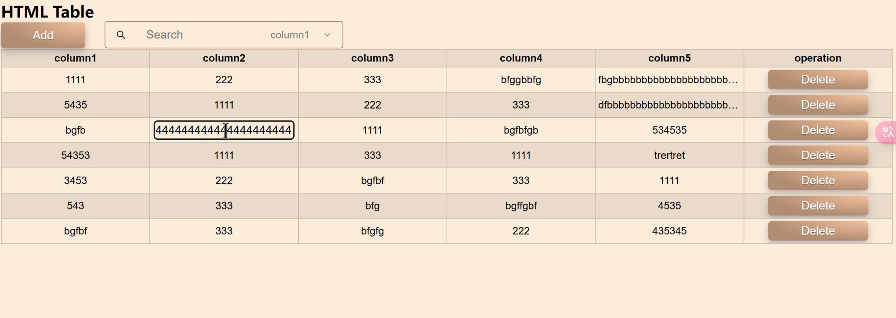
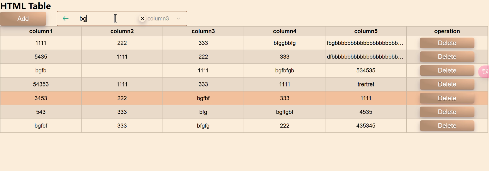

# EditableTable

This is an editable intelligent table, with some styles inspired by examples from the website: Uiverse | The Largest Library of Open-Source UI elements.
As a beginner-level project, the functionality has been carefully adjusted. If you think the style and functionality are good, please like it!

## rendering
### double click to edit:

### press `Enter` to search:
